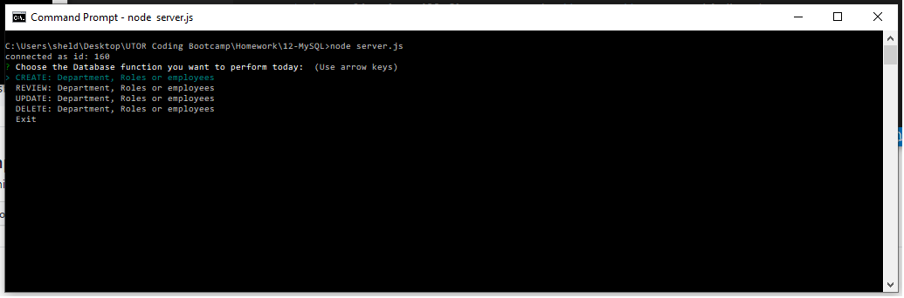

# This is unit 12 MySQL: Company Database Maintenance Application

## Application URL

My code can be found at [Database Maintenance](https://sheldonmall.github.io/employee-management/) 

## Description

This is a CLI application that allows data about department, roles and employees to be created, reviewed, updated and deleted (not yet implemented) in mySQL database.

## Installation

* Please run `npm install` to install the dependancies (inquirer, clear and mysql) before you execute this application.

## Usage 

Execute the application by giving the following command on the command line:
`$node server.js`

* The application has a **Main Menu** which offers `CRUD` options. Once an  option has been chosend, a **Sub-Menu** is presented with options asking which table does the user want to perform the chosen `CRUD` function on. 

- The **Create** option allows to create `Department`, `Role` or `Employee`.
- The **Review** option allows to create `Department`, `Role` or `Employee`.
- The **Update** option allows to create `Department`, `Role` or `Employee`. Only option avilable currently is to update the `Employee` Role based on employee's firstname.
- The **Delete** option allows to create `Department`, `Role` or `Employee`. This option is currently not ready as it is outside the scope of this homework.

My Task list for developing this application are as follows:

[x] Building the application

[x] Running Tests 

[X] Fully functional

[ ] User testing

[ ] User feedback 

## Credits

I have made extensive use of NPM website to check usage and syntax of commands. I sought help from my tutor to understand and approach this homework. @sushmakaluva also helped me debug one of the sub-routines to update employee's role.

## Contributing

I invite and would welcome contributions and ideas. Please contribute to the application at https://github.com/sheldonmall/

## License

There is no need for any license at the moment to use my application.

---

## Tests

The applications is fully functional. Please test it for CRU options.
